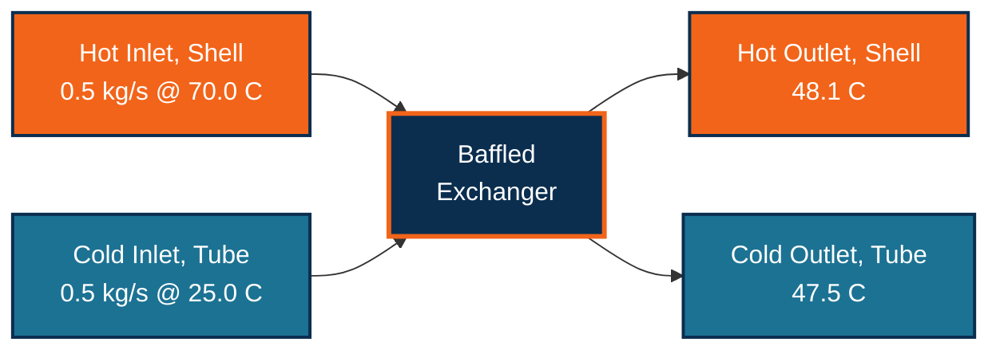
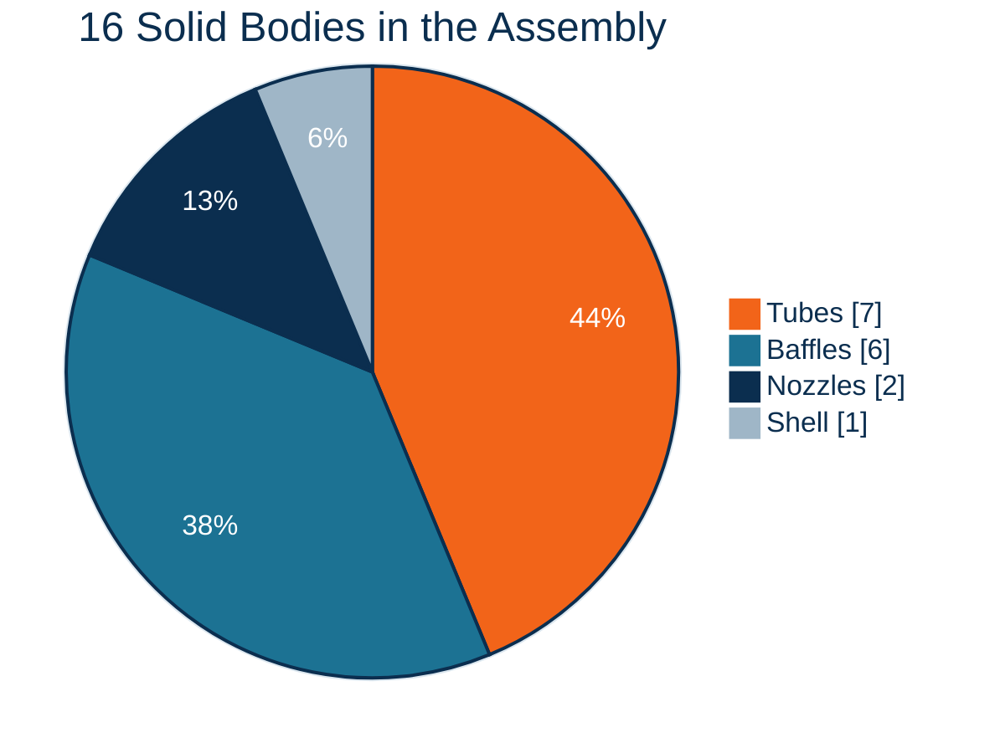
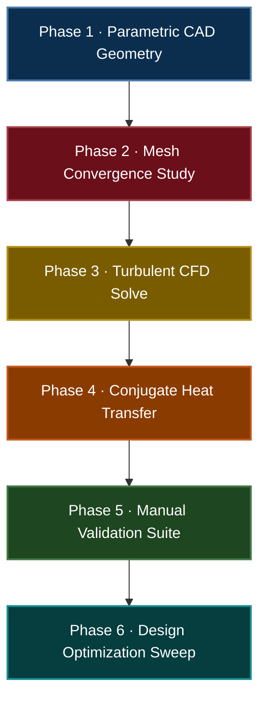

  

<h3 align="center">CAD, CFD Simulation, and Independently Verified Thermal Design of a Baffled Shell and Tube Heat Exchanger</h3>

  
  
  

  
  
  

**[View the Report](./report/Baffled_Shell_Tube_Heat_Exchanger_Report.docx)** &nbsp;•&nbsp; **[View the Presentation](./slides/Baffled_Shell_Tube_Heat_Exchanger_Presentation.pptx)** &nbsp;•&nbsp; **[Report a Bug](../../issues)**

 

## Overview

BaffleX is a complete thermal-fluid engineering study of a seven-tube, six-baffle shell and tube heat exchanger, carried out end to end in COMSOL Multiphysics. A hot water stream sweeps across a baffled tube bundle while a cold water stream flows through the tubes, and the two exchange heat through conjugate wall conduction rather than an assumed heat transfer coefficient.

Every simulated result is independently cross-checked by hand. Energy balance, LMTD, effectiveness-NTU, and Reynolds number calculations are carried out from first principles using only the port-averaged CFD outputs, closing to within a fraction of a percent of the simulation itself.

 

## Screenshots

<table>
<tr>
<td width="50%">

**CAD Geometry**

</td>
<td width="50%">

**Computational Mesh**

</td>
</tr>
<tr>
<td width="50%">

**Temperature Field**

</td>
<td width="50%">

**Isothermal Contours**

</td>
</tr>
<tr>
<td width="50%">

**Velocity Field**

</td>
<td width="50%">

**Pressure Field**

</td>
</tr>
</table>

 

## How It Works

Every downstream panel, the field plots, the derived value tables, and the hand calculations, reads from the same converged solution, so the report and the presentation can never drift out of sync with the model.

 

## Boundary Conditions

Both streams run at an equal 0.5 kg/s, driven by a mass flow inlet and a zero gauge pressure outlet, with the shell modeled as fully adiabatic to the surroundings.

 

## Model Components

**Shell**: 70 mm outer radius, 608.5 mm overall length, 9 mm end caps
**Tube Bundle**: 7 tubes, 10 mm outer diameter, 30 mm triangular pitch
**Baffle Plates**: 6 segmental baffles, 60 mm radius, 80 mm pitch, alternating cut
**Nozzles**: radial inlet and outlet stubs at diagonally opposite ends

 

## Physics Setup

**Turbulence**: k-epsilon RANS with wall functions, justified by Reynolds numbers above 10,000 on both streams
**Heat Transfer**: Conjugate coupling through the tube walls via Nonisothermal Flow multiphysics, no assumed coefficient
**Mesh**: Free tetrahedral with five-layer boundary inflation, locally refined at every curved wall
**Materials**: Aluminium solid domain, temperature-dependent water properties on both streams

 

## Results and Manual Validation

Every quantity below tagged **Hand-Calculated** is derived from the port-averaged CFD values using first-principles heat exchanger theory, energy balance, LMTD, effectiveness-NTU, and Reynolds analysis, not read directly from COMSOL.

**Port Conditions** — *source: CFD*

| Port | Temperature | Gauge Pressure |
|---|---|---|
| Hot Inlet, Shell | 70.09 °C | 194.29 Pa |
| Hot Outlet, Shell | 48.08 °C | −3.76 Pa |
| Cold Inlet, Tube | 25.29 °C | 79.10 Pa |
| Cold Outlet, Tube | 47.45 °C | −2.07 Pa |

**Energy Balance** — *Hand-Calculated*

| Quantity | Value |
|---|---|
| Heat duty, hot side, Q hot | 46.00 kW |
| Heat duty, cold side, Q cold | 46.31 kW |
| Average heat duty, Q | 46.16 kW |
| Balance closure | 0.68% |

**LMTD and Overall Heat Transfer Coefficient** — *Hand-Calculated*

| Quantity | Value |
|---|---|
| ΔT₁ (hot in − cold out) | 22.64 K |
| ΔT₂ (hot out − cold in) | 22.79 K |
| Log mean temperature difference, LMTD | 22.72 K |
| Heat transfer area, A | 0.1338 m² |
| Overall U, LMTD method | 15,180 W/(m²·K) |

**Effectiveness-NTU Cross-Check** — *Hand-Calculated*

| Quantity | Value |
|---|---|
| Capacity rate, C min = C max | 2090 W/K |
| Maximum possible heat transfer, Q max | 93.63 kW |
| Effectiveness, ε | 49.3% |
| Number of transfer units, NTU | 0.972 |
| Overall U, effectiveness-NTU method | 15,190 W/(m²·K) |
| Agreement between the two U methods | within 0.1% |

**Reynolds Number Check** — *Hand-Calculated*

| Stream | Reynolds Number | Regime |
|---|---|---|
| Tube side | ≈ 13,000 | Turbulent |
| Shell side, local at baffle window | ≈ 11,500 | Turbulent |
| Shell side, bulk average | ≈ 700 | Laminar, bulk only |

**Pressure Drop** — *source: CFD*

| Stream | Pressure Drop |
|---|---|
| Shell side, hot | 198.0 Pa |
| Tube side, cold | 81.2 Pa |

 

## Roadmap

Phases 1 through 5 are complete. Phase 6 opens the geometry to a parametric sweep, more baffles, tighter pitch, longer shell, to push effectiveness past the current 49.3% without a meaningful pressure drop penalty.

 

## Tech Stack

COMSOL Multiphysics, CFD Module and Heat Transfer Module, for geometry, meshing, and the coupled Nonisothermal Flow solve. Results are packaged into a fully formatted Word report and a PowerPoint deck, both generated programmatically from the converged solution to keep every figure and number traceable to the model.

 

## Reproducing This Study

1. Open the model in COMSOL Multiphysics (CFD Module and Heat Transfer Module required).
2. Rebuild the geometry sequence to regenerate the parametric shell, tube bundle, and baffles.
3. Run the predefined free tetrahedral mesh sequence, including boundary layers.
4. Solve the Stationary study coupling Turbulent Flow, k-epsilon with Heat Transfer in Fluids.
5. Regenerate derived values and field plots, or open the included report and slides directly.

 

## Contributing

1. Fork the repo
2. Create a branch: `git checkout -b feature/your-feature`
3. Commit your changes
4. Open a pull request

 

## References

Cengel, Y. A., and Ghajar, A. J. *Heat and Mass Transfer: Fundamentals and Applications.* McGraw Hill.
Incropera, F. P., DeWitt, D. P., Bergman, T. L., and Lavine, A. S. *Fundamentals of Heat and Mass Transfer.* Wiley.
COMSOL AB. *CFD Module and Heat Transfer Module User's Guide.* COMSOL Multiphysics.

 

## License

Distributed under the MIT License. See `LICENSE` for details.

 

Built by <a href="https://github.com/fraisasghar">Frais Asghar</a>

If this project was useful to you, consider giving it a star. ⭐

<p3 align="center">Built for the Mechanical &amp; Thermal-Fluid Engineering community &nbsp;&middot;&nbsp; Happy building</p3>

